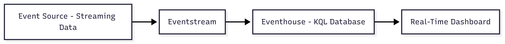
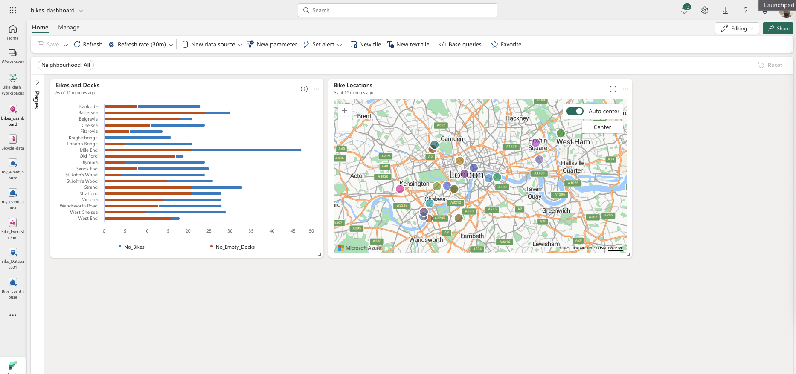

# Real-Time Dashboard in Microsoft Fabric

This repository contains a simple yet practical implementation of a **real-time dashboard** in Microsoft Fabric, created as part of the [official Microsoft Learn lab](https://microsoftlearning.github.io).

The goal of this exercise was to explore **Real-Time Intelligence** capabilities within Microsoft Fabric, from data ingestion to live visualization.

---

## 🎯 Objective

To build an end-to-end flow that:
1. Captures streaming data from an **Eventstream**.
2. Stores the data in an **Eventhouse** (KQL database).
3. Displays metrics on a **Real-Time Dashboard** with live updates.

---

## 🛠️ Technologies Used

- **Microsoft Fabric**
- **Eventstream** – for real-time ingestion  
- **Eventhouse (KQL Database)** – for storing and querying the data  
- **Kusto Query Language (KQL)** – to power dashboard queries  
- **Real-Time Dashboard** – for interactive live visualization

---

## 🔄 Flow Architecture



**Steps:**
1. **Event Source** – streaming data source (simulated in the lab).  
2. **Eventstream** – captures and transforms incoming events.  
3. **Eventhouse** – stores events and supports real-time KQL queries.  
4. **Real-Time Dashboard** – displays aggregated data with auto-refresh.

---

## 📌 Implementation Steps

### 1) Create Eventstream
- Configure a simulated streaming data source.
- Apply initial transformations and field mappings.

### 2) Connect to Eventhouse
- Create a KQL database in Microsoft Fabric.
- Link the Eventstream to store incoming events.

### 3) Write KQL Queries
Example used in the dashboard:

```kql
EventsTable
| summarize Count = count() by Category, bin(Timestamp, 1m)
| order by Timestamp desc
```

4) Build Real-Time Dashboard
Add tiles based on KQL queries.

Configure parameters for interactive filtering.

Enable auto-refresh for continuous live updates.

📷 Screenshots
Dashboard (real-time):



🎥 Live Example


📚 Key Learnings
How Microsoft Fabric integrates ingestion, transformation, and visualization in a unified environment.

The difference between traditional historical dashboards and streaming dashboards.

The importance of KQL for fast, efficient queries in real-time analytics.

🚀 Potential Real-World Applications
IoT monitoring for devices and sensors.

Live sales dashboards for retail environments.

Security incident tracking in real-time.

📎 Reference
Based on the official Microsoft Learn lab:
Create a real-time dashboard in Microsoft Fabric


## 📚 Keep up with the Dashboard updates
https://app.fabric.microsoft.com/links/7EMdCHp4if?ctid=e4bd69ff-e6f7-4c2e-b247-41b54ba2490e&pbi_source=linkShare&experience=fabric-developer&extensionScenario=openArtifact&v-_startTime=1hours&v-_endTime=now&page=da852092-204b-4337-9c44-5479fcaa69a8&v-selected_neighbourhoods=all
